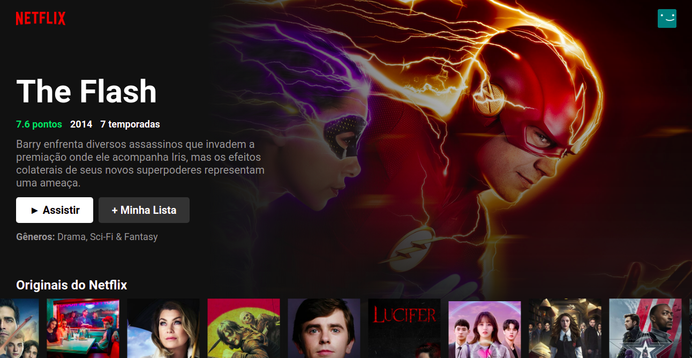

<p align="center">
  <a href="" rel="noopener">
 </a>
</p>

<h3 align="center">netflix-ui-clone</h3>

<div align="center">

[]()
[](https://www.reddit.com/user/Wordbook_Bot)
[](https://github.com/kylelobo/The-Documentation-Compendium/issues)
[](https://github.com/kylelobo/The-Documentation-Compendium/pulls)
[](/LICENSE)

</div>

---

## 📝 Tools used

- [Api themoviedb](https://api.themoviedb.org)

## 📝 Table of Contents

- [Demo / Working](#demo)
- [Getting Started](#getting_started)

## 🎥 Demo / Working <a name = "demo"></a>

</a>

## 🏁 Getting Started <a name = "getting_started"></a>

### Prerequisites

What things you need to install the software and how to install them.

- node.js
- npm

### Installing

Go into the project folder and run

```
  npm install || yarn
```

right after it installs all the packages you can run the command

```
  npm start
```

This will make the project start running in [http://localhost:3000/](http://localhost:3000)

### Reference

- [🔥 Clone do NETFLIX em REACTJS para Iniciantes](https://www.youtube.com/watch?v=tBweoUiMsDg)
